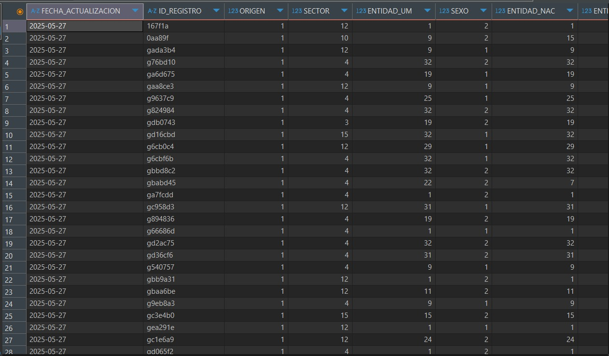

# Base de datos: Covid-19

## Objetivos:

- Crear la base de datos y tablas correspondientes a partir de las tareas del modelo relacional y e-r
- Incluir al menos 20 registros en la base de datos

## Creacion de la base de datos
La base de datos se creo a partir de las  tareas de modelo relacional y entidad-relación. 
## Visualización.
A continuación se mostrara algunos registros de alunas columnas de la base de datos.
